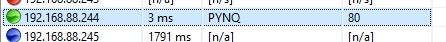
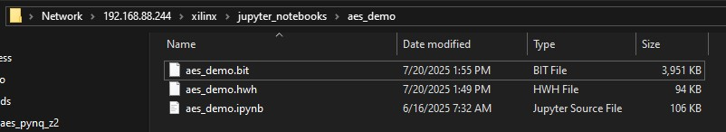
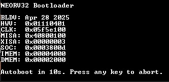
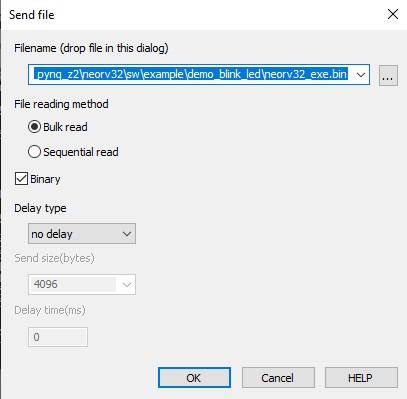

# Introduction
This is the central repository containing build scripts and dependencies to build a [NEORV32](https://stnolting.github.io/neorv32/#_overview) RTL image targeting the [PYNQ-Z2](https://www.amd.com/en/corporate/university-program/aup-boards/pynq-z2.html) board. This build flow is targeting a custom NEORV32 implementation, but can be modified for other version of the core as well. For details on re-configuring the NEORV32 core, refer to the [build.py](build.py) script.

The purpose of this NEORV32 implementation is to add a custom AES-128 sub-module to the NEORV32 [Custom Functions Subsystem](https://stnolting.github.io/neorv32/#_custom_functions_subsystem_cfs) (CFS). The AES implementation can be found [here](https://github.com/Blinerator/aes-128-fpga). The project hierarchy is managed using git submodules.

To interact with the NEORV32 core, the A0 and A1 GPIO pins on the devkit have been configured as TX and RX for the NEORV32 UART console.

# Dependencies
This build flow is intended for Vivado 2023.2, it is untested on other versions.

To clone down this repository and all dependencies, run this command:

`git clone git@github.com:Blinerator/neorv32_aes_pynq_z2.git --recurse-submodules`

Or, if the project has already been cloned down, run this command to initialize, fetch, and checkout submodules:

`git submodule update --init --recursive`

# Generating a bitstream
The build.py script handles building the project from start to finish. It creates a Vivado project in the syn/ directory; if the block diagram needs to be changed, it should be modified in the Vivado GUI and then exported to `syn/block_design.tcl`. It will be automatically sourced on the next build.

To run a build, execute the following in this directory:

`py ./build.py`

# Loading the bitstream
To load the bitstream onto the PYNQ-Z2 board, ensure you have the board configured according to the [PYNQ-Z2 Setup Guide](https://pynq.readthedocs.io/en/v2.3/getting_started/pynq_z2_setup.html). Assuming the board is connected to your computer via Ethernet, connect to the board at 192.168.2.99. The board may have a different default IP address. Run a program like [Angry IP Scanner](https://angryip.org/) to find the IP, it should look something like this:


After connecting to the board, Copy the hardware handoff file (`syn/aes_project.gen/sources_1/bd/block_design/hw_handoff/block_design.hwh`) and the bitstream (`syn/aes_project.runs/impl_1/block_design_wrapper.bit`) into `xilinx/jupyter_notebooks/aes_demo/`. Also create a new Python notebook called `aes_demo.ipynb`. Make sure to rename the files as shown below.


This notebook is only needed to load the bitstream. Create a cell with the following code, then run it:

```python
from pynq import Overlay

ol = Overlay("./aes_demo.bit")
```

This will load the NEORV32 core onto the PL of the SOC. Once loaded, you should see an LED blink on the board for 10 seconds, which is the window to load a custom program into the NEORV32 processor. You should also see a splash screen if connected to the A0 (TX) and A1 (RX) GPIO pins through UART.



# Uploading the executable
To upload the executable (`neorv32_exe.bin`), press 'u', then use the "send" function of your terminal program to send the file. Make sure the "Binary" option is enabled. This is the setup when using the File -> Send file feature of TeraTerm:

